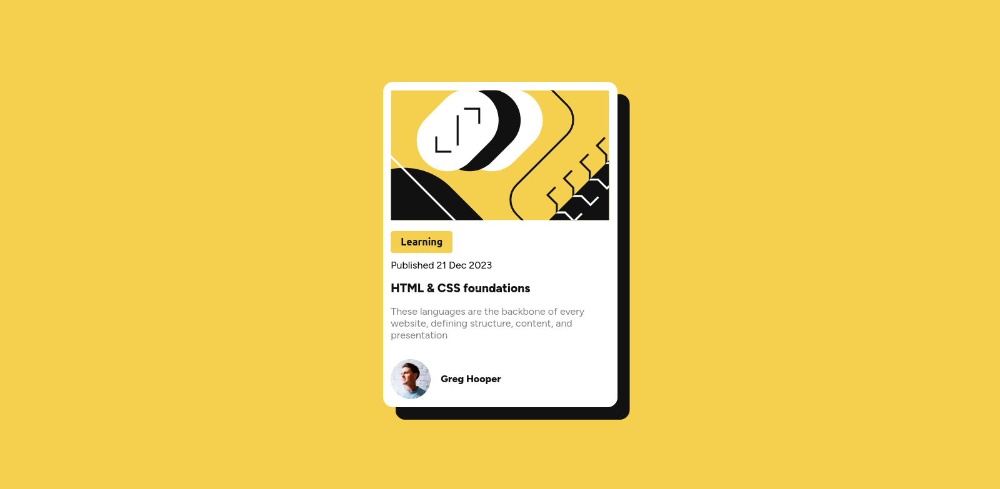

# Frontend Mentor - Blog preview card solution

This is a solution to the [Blog preview card challenge on Frontend Mentor](https://www.frontendmentor.io/challenges/blog-preview-card-ckPaj01IcS). Frontend Mentor challenges help you improve your coding skills by building realistic projects.

## Table of contents

- [Overview](#overview)
  - [The challenge](https://www.frontendmentor.io/learning-paths/getting-started-on-frontend-mentor-XJhRWRREZd/steps/665d8f806ec3887a3b0816bc/challenge/start)
  - [Screenshot](./assets/images/screenshots.png)
  - [Live Site](https://limsael.github.io/blog-preview-card/)
- [My process](#my-process)
  - [CSS Flexbox](https://developer.mozilla.org/en-US/docs/Learn/CSS/CSS_layout/Flexbox)
  - [CSS Grid](https://developer.mozilla.org/en-US/docs/Web/CSS/grid)
  - [Google Fonts](https://fonts.google.com/)

## Overview

### The challenge

Users should be able to:

- See hover and focus states for all interactive elements on the page

### Screenshot



### Links

- Solution URL: [Add solution URL here](https://your-solution-url.com)
- Live Site URL: [The Live Site](https://limsael.github.io/blog-preview-card/)

## My process

### Built with

- Semantic HTML5 markup
- Flexbox
- CSS Grid

### What I learned

```css
a {
  font-size: 1.2rem;
  color: $Black;
  font-weight: $bold-weight;
  transition: color 0.3s ease;

  &:where(:hover, :focus) {
    color: $yellow;
  }
}
```

### Continued development

- The card
- The image

### Useful resources

- [Modzilla Developer Network](https://developer.mozilla.org/en-US/) - This helped me for CSS Grid & CSS Flexbox.
- [Google Fonts](https://fonts.google.com/) - This is an amazing website which helped me choosing the fonts of the project

## Author

- Github - [Salim Toure](https://github.com/limsael)
- Frontend Mentor - [@limsael](https://www.frontendmentor.io/profile/limsael)
